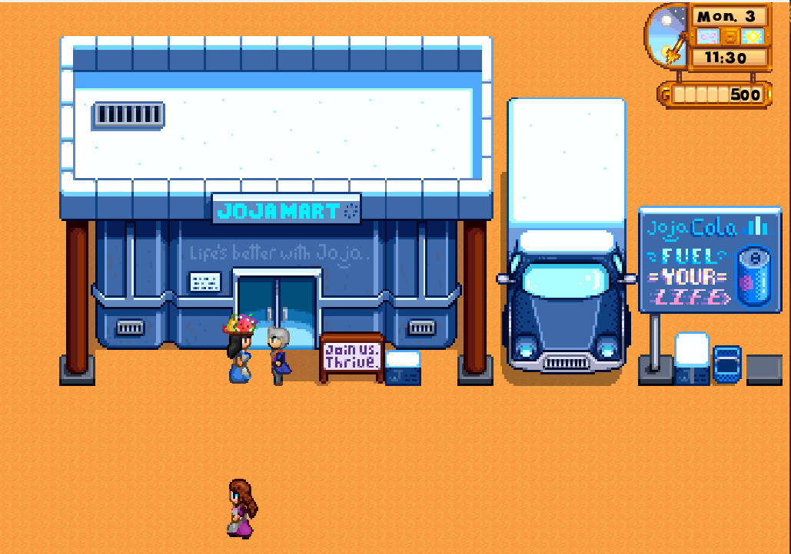
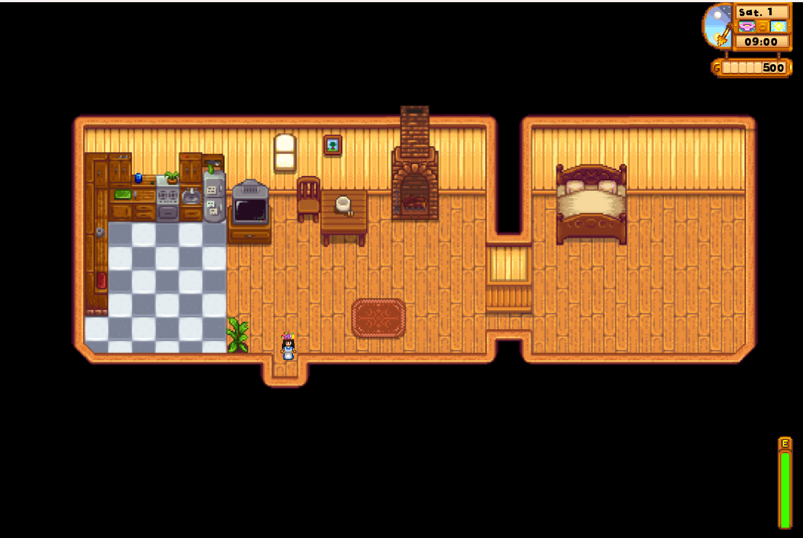
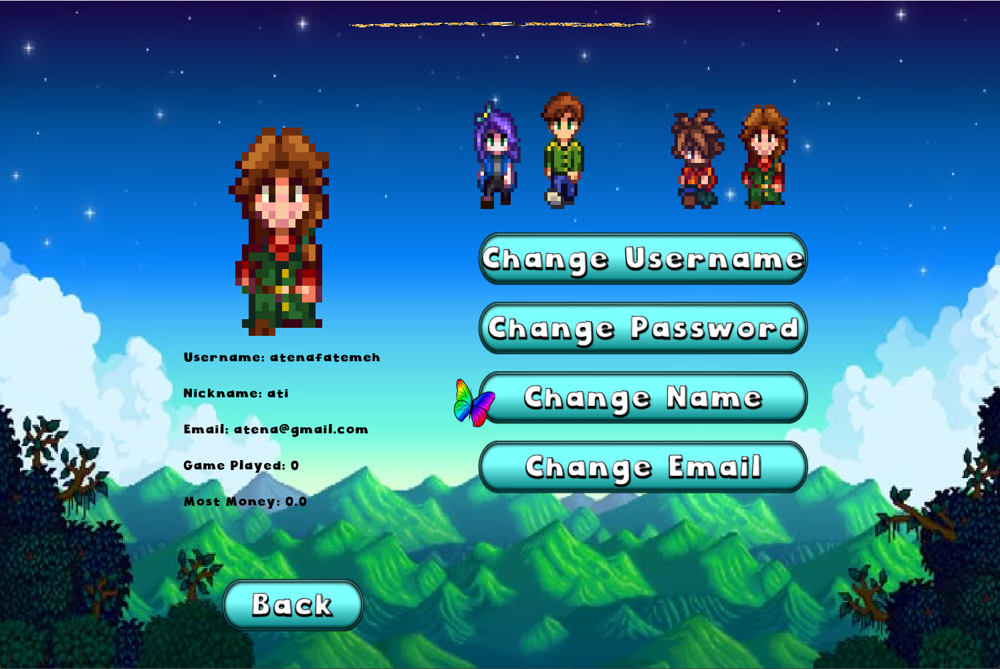
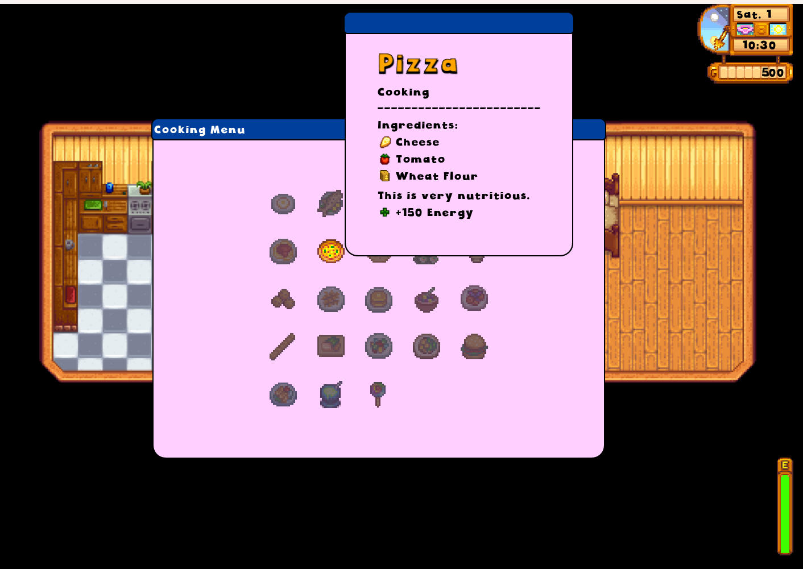
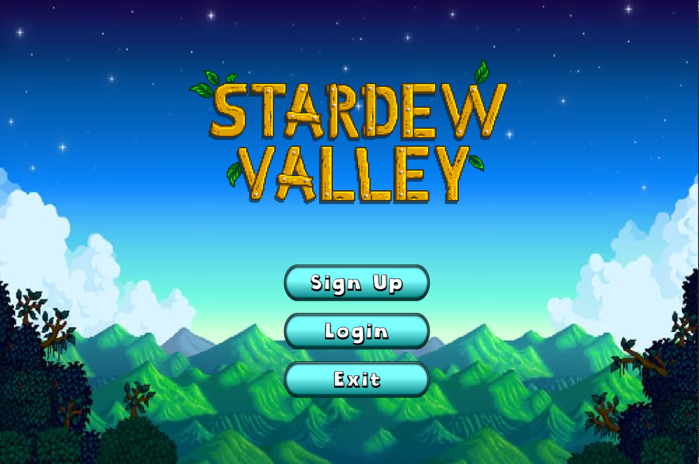

# 🌾 Stardew Valley — Java Edition

> A **Java implementation of a Stardew Valley-inspired farming simulation**, featuring core gameplay systems, a libGDX graphical interface, and real-time network multiplayer for up to four players over a client-server architecture.
> Developed across three progressive phases as the final project for the Advanced Programming course. 🌾



## 🎮 Features

**Graphical gameplay (libGDX)**
* Full graphical desktop client: tile-based world rendering, animated player sprites, buildings and NPCs
* HUD with clock, energy bar, currency, and active buffs; drag-and-drop inventory
* Menu system for start/login/inventory/crafting/cooking/shops, all rendered with libGDX Scene2D



**Real-time network multiplayer**
* Client-server architecture: the server holds authoritative game state and logic, clients render the graphical UI from server responses, with multithreading handling concurrent players
* Lobby system — create/join public or private (password-protected) lobbies, up to 4 players, with an admin role and auto-cleanup of idle lobbies
* Real-time (not turn-based) play once online: simultaneous movement, live map sync, player interactions (gifting, hugging, marriage), and shared shop inventory across all connected clients
* In-game public/private chat, live scoreboard, group quests, and player voting/kick system
* Authentication and disconnect/reconnect handling



**Core gameplay**
* Turn-based single-device loop with hourly / day / season progression
* Four skill tracks: Farming, Mining, Foraging, Fishing
* Crop cultivation, fruit trees, seasonal planting, fertilizers, and a greenhouse
* Livestock (chickens, cows, goats, sheep, pigs, rabbits, dinosaurs, ostriches) and artisan production (kegs, preserves jars, cheese presses, looms, oil makers)
* Cooking system with recipes, buffs, and energy restoration
* 7 shops with distinct inventories (Blacksmith, JojaMart, Pierre's General Store, Carpenter's Shop, Fish Shop, Marnie's Ranch, The Stardrop Saloon)
* 5 romanceable NPCs with friendship levels and a full marriage system
* Tile-based world map (300×200) with BFS pathfinding and terrain-aware movement costs
* JSON-based save/load system with automatic asset manifest generation



## 🛠️ Technologies

* **Java 17**
* **libGDX 1.13.1** (LWJGL3 backend) — graphics, input, game loop
* **Client-server networking** with multithreading for real-time multiplayer
* **Gradle 8.14** (wrapper)
* **Jackson 2.17** — JSON persistence
* **gdx-controllers 2.2.3** — gamepad support
* **Box2D** (via libGDX) — physics
* **GraalVM / gdx-svmhelper 2.0.1** — optional native image builds

## 📁 Project Structure

```text
AP-StardewValley/
├── assets/                 # Game assets (textures, fonts, audio)
├── core/                   # Shared game logic (model / controller / view, MVC)
│   ├── model/               # Domain models (agriculture, animal, crafting, NPC, map, ...)
│   ├── controller/           # Game logic controllers
│   └── view/                 # Rendering & UI (libGDX Scene2D)
├── lwjgl3/                 # Desktop launcher (LWJGL3)
├── data/                    # Runtime JSON data (users.json, savefile.json)
├── documents/               # Original Phase 1–3 course specifications
├── gradle/                  # Gradle wrapper
├── build.gradle
├── settings.gradle
└── README.md
```

Follows an **MVC architecture** with Singleton (shops/managers), Factory (food/items), and State machine (menu system) design patterns.

## 🔨 Build and Run

This is a full graphical game — built on **libGDX** for rendering, input, and the game loop, with a dedicated **core** module (game logic, shared by all players) and an **lwjgl3** desktop launcher that opens the actual game window. Multiple players play locally within the same running instance, sharing the graphical world and taking turns through the same interface.

### Prerequisites
* **Java 17+** (tested with OpenJDK 17)
* Gradle wrapper included in the repo (`./gradlew`) — no separate Gradle install needed
* A desktop environment capable of running an LWJGL3/OpenGL window (this is a graphical, not console, application)

### Running the game (Desktop, graphical)
From the project root:
```bash
./gradlew :lwjgl3:run
```
This compiles the `core` module and launches the LWJGL3 desktop client, opening the game window with the full graphical interface: tile-based world rendering, HUD (clock, energy, currency, buffs), menus, and player sprites.



### Playing in multiplayer (network)
Up to **four players** can join the same session over the network, each from their own device:
* Start the server so it can accept client connections.
* Launch a client per player with `./gradlew :lwjgl3:run`, log in / sign up, then create or join a **lobby** from the lobby menu (public or private/password-protected).
* Once the lobby host starts the game, all connected players play **simultaneously in real time** — no turn order — sharing the same live map, shop inventories, chat, and player interactions.

### Building a distributable JAR
```bash
./gradlew :lwjgl3:jar
# Output: lwjgl3/build/libs/Stradew Valley-1.0.0.jar
```

### Platform-specific builds
```bash
./gradlew :lwjgl3:jarMac    # macOS
./gradlew :lwjgl3:jarLinux  # Linux
./gradlew :lwjgl3:jarWin    # Windows
```

> **Note:** the working directory at runtime is `assets/`; save/user data is resolved relative to it (`../data/users.json`, `../data/savefile.json`), so run the JAR/launcher from the expected location or keep the project's folder structure intact.

## 👥 Contributors

**Advanced Programming Course**

* [Fatemeh Nilforoushan](https://github.com/fnilli)
* [Atena Raeisi](https://github.com/atenaraeisi)
* [Fatemeh Mirshekar](https://github.com/FMirshekar)

## 🎓 Credits

**Sharif University of Technology**
Department of Computer Engineering

**Course:** Advanced Programming
**Academic Year:** _2025_

**Instructor:** Dr. Mohammad Amin Fazli
